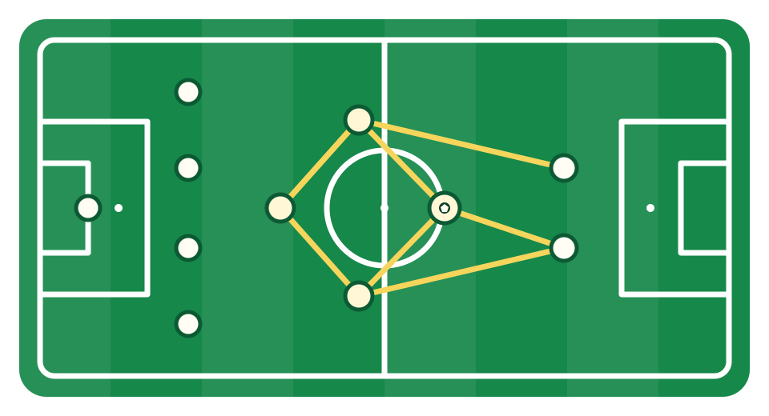

<p align="center">
  
</p>

<h1 align="center">TikiAgent</h1>

<p align="center">
  A multi-agent task execution system for research, coding, and hybrid workflows.
</p>

<p align="center">
  
  
  
  <a href="LICENSE"></a>
</p>

TikiAgent 使用 Supervisor 动态规划和委派任务，由 ResearchAgent 与 CodeAgent 完成专业工作，再通过 Verification Gate 验证交付结果。独立的 Context Engine 控制每位 Agent 看见什么，Execution Harness 控制工具如何安全、可恢复地执行，Application Plane 提供 Session、CLI、Event Stream 和 Conversation-first Textual TUI。

> 当前稳定版本：**v1.0.0**。项目不把 Demo Validation 描述为统计 Evaluation，也不声明未经实验支持的 Multi-Agent 性能优势。

## Features

| 能力 | 说明 |
|---|---|
| Multi-Agent orchestration | Supervisor 根据任务路由 ResearchAgent、CodeAgent，并在失败后重新规划 |
| Verification loop | Research 使用来源规则验证，Code 使用只读环境与产物验证 |
| Context engineering | History、Retriever、Task Board、Context Profiles、Compression 与 Notepad |
| Execution harness | Tool Exposure、Permission、Approval、Workspace、Timeout、Checkpoint 与 Trace |
| Recovery semantics | Approval 暂停、Checkpoint Resume、未知副作用 Recovery/Reconcile |
| OpenAI-compatible backend | 可连接 DeepSeek 官方 API 或本地 vLLM OpenAI-compatible endpoint |
| Web research | Tavily Search/Extract，保留可追溯 Web Observation 和来源 URL |
| Application interfaces | CLI、Event Stream、三类冻结 Demo 与 Textual 交互终端 |

## Architecture

```text
                         User / CLI / TUI
                                │
                                ▼
                        Application Plane
                  Session · Turn · Router · Events
                                │
                                ▼
                           Supervisor
                    Plan · Route · Delegate
                         ╱             ╲
                        ▼               ▼
                ResearchAgent       CodeAgent
                        ╲               ╱
                         ▼             ▼
                       Verification Gate
                                │
                                ▼
                           Supervisor
                         Continue / Finish

     Context Plane                              Execution Plane
 State · Task Board · History              Exposure · Permission
 Retriever · Context Builder               Approval · Workspace
 Monitor · Compressor · Notepad            Checkpoint · Trace
```

核心控制流：

```text
Supervisor Decision
        ↓
Structured Handoff
        ↓
Specialist Result
        ↓
Verification(result_id + handoff_id + subject_agent)
        ↓
Supervisor FINISH / RETRY / DELEGATE
```

完整设计见 [Architecture](docs/architecture.md) 和 [Design Decisions](docs/design-decisions.md)。

## Quick Start

### Requirements

- Python 3.13+
- [uv](https://docs.astral.sh/uv/)
- OpenAI-compatible 模型 API
- Tavily API Key（仅 Research/Hybrid 任务需要）

### Install

```powershell
git clone https://github.com/ZhuYaozong/TikiAgent.git
cd TikiAgent
uv sync --locked
Copy-Item .env.example .env
```

编辑 `.env`：

```dotenv
TIKI_LLM_API_KEY=your-model-api-key
TIKI_LLM_BASE_URL=https://api.deepseek.com
TIKI_LLM_MODEL=deepseek-chat

TIKI_SEARCH_PROVIDER=tavily
TIKI_TAVILY_API_KEY=tvly-your-key
TIKI_TAVILY_BASE_URL=https://api.tavily.com
```

`.env` 已被 Git 忽略。不要把真实 API Key 写入 README、示例代码或提交记录。

### Start the TUI

```powershell
uv run --locked tikiagent-tui --data-dir .tiki --env-file .env
```

进入界面后直接输入任务，例如：

```text
搜索近期重要的 AI Agent 新闻并总结来源
```

或：

```text
调研近期 Agent Framework 的重要变化，并根据结果生成 comparison.html
```

TUI 支持多轮 Session、Markdown 最终回答、实时 Agent/Tool/Verification Feed、Approval、Recovery 和只读 Workspace Tree。详细命令见 [Textual TUI](docs/tui.md)。

## Demo Validation

项目冻结了三个可重复的产品场景：

```powershell
# 只查看任务、Agent 和验收条件，不调用外部 API
uv run --locked tikiagent-demo hybrid --dry-run --json

# 真实运行
uv run --locked tikiagent-demo research
uv run --locked tikiagent-demo coding
uv run --locked tikiagent-demo hybrid
```

| 场景 | 路由 | 交付 |
|---|---|---|
| Research | Supervisor → ResearchAgent → Verification | 带来源 URL 的调研总结 |
| Coding | Supervisor → CodeAgent → Verification | 代码、文件与自动化测试结果 |
| Hybrid | ResearchAgent → CodeAgent → Verification | 基于调研证据生成的对比网页 |

每次真实 Demo 会在 `.tiki-demo/demo-runs/<RUN_ID>/` 保存 Application Timeline、Harness Trace 摘要、最终结果和产物引用。完整说明见 [Demo Validation](docs/demos.md)。

## CLI

创建 Session：

```powershell
uv run --locked tikiagent --data-dir .tiki --env-file .env `
  new-session --workspace-id demo
```

提交任务：

```powershell
uv run --locked tikiagent --data-dir .tiki --env-file .env `
  submit --session-id <SESSION_ID> `
  --message "创建一个包含 unittest 的 Python 计算器项目"
```

查看权威运行状态：

```powershell
uv run --locked tikiagent --data-dir .tiki `
  status --session-id <SESSION_ID>
```

CLI 还提供 `resume`、`recover` 和 `reconcile`。这些入口读取 Session 引用的权威 Checkpoint，不从 UI 状态或 Trace 猜测恢复位置。

## Execution Safety

正式工具执行路径：

```text
Raw ToolCall
    ↓ validate + canonicalize
Tool Exposure Guard
    ↓
Permission: ALLOW / ASK / DENY
    ↓
Approval Scope + Fingerprint
    ↓
Checkpoint(executing)
    ↓
Workspace / Runtime Enforcement
    ↓
ToolResult + Trace
```

关键保证：

- 未暴露给当前 Agent 的工具不能通过伪造 ToolCall 执行；
- ASK 是独立 `awaiting_approval` 状态，不伪造成失败 ToolResult；
- Approval 绑定 task、session、workspace、规范化参数和 fingerprint；
- ToolCall 与 ToolResult 在 Local Memory 中保持原子配对；
- Checkpoint 是 Resume source of truth，Trace 只用于审计；
- `executing` 状态崩溃后禁止自动重放，必须人工 Recovery/Reconcile；
- Workspace Boundary、Timeout 和 Output Limit 在模型决策之外机械执行。

> Workspace Boundary 不是操作系统级 Sandbox。不要把 v1.0 当作不可信代码的强隔离容器。

## Project Structure

```text
src/tikiagent/
├── agents/          # Supervisor、ResearchAgent、CodeAgent 的角色策略
├── runtime/         # 单 Agent ReAct 循环、暂停与恢复
├── orchestration/   # 多 Agent Workflow、State、Handoff 与完成条件
├── verification/    # 统一验证入口及 Research / Code / Artifact 验证
├── context/         # 上下文组装，memory/ 信息源，compression/ 预算与压缩
├── tools/           # 工具协议、Registry、Dispatcher 与工具实现
├── harness/         # 执行强制边界，permissions/ 审批，persistence/ 恢复与审计
├── providers/       # llm/ 模型适配与 search/ 搜索服务适配
├── application/     # Session、Intent Router、Controller、Events 与应用装配
├── interfaces/      # CLI 与 tui/ Textual 界面、纯显示投影
├── baselines/       # 独立保留的 ReAct Graph、Plan/Verify 基线
└── demo/            # Research / Coding / Hybrid 场景与结果收集

examples/            # ReAct → LangGraph → Plan/Verify → Multi-Agent 基线
tests/               # 离线自动化测试
docs/                # 架构、设计决策、TUI、Demo 与演进说明
```

各目录的入口文件、依赖边界与 Python 导入迁移说明见 [模块导航](docs/module-layout.md)。

## Design Principles

| 边界 | 定义 |
|---|---|
| Agent vs Harness | Agent 决定做什么；Harness 决定如何执行 |
| Retriever vs Context Builder | Retriever 找相关信息；Builder 组装 Agent Context |
| State vs History | State 保存当前 Workflow 事实；History 保存未来可检索信息 |
| Memory vs Checkpoint | Memory 支持当前工作；Checkpoint 支持崩溃恢复 |
| History vs Trace | History 面向未来 Agent；Trace 面向执行审计 |
| Tool Selection vs Permission | Selection 控制展示；Permission 控制是否允许执行 |
| Verifier vs Supervisor | Verifier 提供证据；Supervisor 决定下一条控制边 |

## Testing

自动测试不调用真实模型或 Tavily，使用 Fake Model、Fake Provider 和临时 Workspace：

```powershell
uv run --locked pytest -q
uv run --locked python -m compileall -q src tests
```

当前覆盖包括 Agent 路由、Result/Verification 身份链、Context Compression、Tool Exposure、Permission/Approval、Checkpoint/Resume、Recovery/Reconcile、Session、Event Stream、Artifact Verification、TUI 投影和三类 Demo 生命周期。

真实 API Demo 会产生费用和外部请求，不属于默认测试套件。

## Documentation

| 文档 | 内容 |
|---|---|
| [Architecture](docs/architecture.md) | Control、Context、Execution、Application 四个平面 |
| [Design Decisions](docs/design-decisions.md) | 身份链、上下文隔离、恢复语义与关键不变量 |
| [Architecture Evolution](docs/architecture-evolution.md) | ToolCall → ReAct → LangGraph → Multi-Agent 演进 |
| [Textual TUI](docs/tui.md) | 交互界面、快捷键、Approval 与 Recovery |
| [Demo Validation](docs/demos.md) | 三类场景、产物、暂停和恢复 |
| [Changelog](CHANGELOG.md) | 发布变化与已知限制 |

## Current Limitations

- 单机 JSONL Checkpoint/History，不提供多进程文件锁或分布式 exactly-once；
- Token 使用字符近似估算，尚未接入供应商精确 Tokenizer；
- Compressor 使用确定性规则，尚未实现 LLM Structured Summary；
- Artifact-aware Verifier 首版聚焦 Python、HTML 和普通文本；
- Research Verification 能证明来源来自真实 Observation，不能自动证明网页内容绝对真实；
- Demo Validation 不提供任务集、重复采样、成本统计或 Single/Multi-Agent 量化对比。

## Contributing

欢迎通过 Issue 提交缺陷、设计讨论或新 Specialist Agent 建议。提交 PR 前请运行离线测试，并确保不提交 `.env`、`.tiki/`、`.tiki-demo/` 或真实 API Key。

## License

TikiAgent 使用 [MIT License](LICENSE) 发布。
